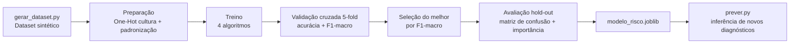

# Arandu — Modelo de Machine Learning de Risco Agrícola

Componente de Inteligência Artificial / Machine Learning do projeto **Arandu**,
uma plataforma que leva dados aeroespaciais e climáticos ao pequeno agricultor
familiar. Este repositório contém **apenas o modelo de ML**: dados, treino e
avaliação.

---

## Integrantes do Grupo

| Nome completo | RM |
|---------------|----|
| _Caio Alexandre dos Santos_ | _558460_ |
| _Leandro do Nascimento Souza_ | _558893_ |
| _Rafael de Mônaco Maniezo_ | _556079_ |
| _Vinicius Rozas Pannuci de Paula Cont_ | _555338_ |

---

## 1. Resumo

| Item | Descrição |
|------|-----------|
| **Tema** | Inteligência artificial aplicada a dados de satélite e clima no agronegócio familiar. |
| **Desafio** | Pequenos agricultores percebem o estresse da lavoura só quando o prejuízo já está consolidado. |
| **Objetivo** | Prever o risco de estresse hídrico / quebra de safra de uma lavoura **nas próximas duas semanas**, classificando-o em Baixo, Moderado ou Alto. |
| **Solução** | Pipeline de ML supervisionado que recebe 7 indicadores de satélite/clima e devolve a classe de risco, com métricas e explicabilidade. |

**Objetivo de negócio:** antecipar o problema (não apenas reportá-lo), permitindo
ao agricultor agir antes da perda de safra.

**Objetivo técnico:** treinar e avaliar um classificador multiclasse que atinja
**acurácia ≥ 75% em validação cruzada**.

---

## 2. Dataset

As fontes reais de dados do Arandu seriam NASA POWER, INMET, IBGE/PAM e NDVI
Sentinel-2. Neste repositório usa-se um **dataset sintético agronomicamente
fundamentado**, com as mesmas features e o mesmo alvo, de modo que o modelo
aceite dados reais no futuro sem mudança de contrato.

- **3.000 amostras**, geração reprodutível (`SEED = 42`).
- Rótulo derivado de um **índice latente de estresse hídrico** (balanço hídrico,
  vigor vegetativo, fenologia e sensibilidade da cultura) + ruído gaussiano,
  discretizado por quantis.
- Distribuição realista (desbalanceada): **60% Baixo · 25% Moderado · 15% Alto**.

### Features de entrada

| Feature | Descrição |
|---------|-----------|
| `ndvi_atual` | NDVI da última leitura |
| `variacao_ndvi_15d` | Tendência do NDVI nos últimos 15 dias |
| `temperatura_media_7d` | Média de temperatura na semana (°C) |
| `precipitacao_acumulada_30d` | Chuva acumulada em 30 dias (mm) |
| `radiacao_solar_media` | Insolação média do período (MJ/m²/dia) |
| `tipo_cultura` | Categórica codificada (milho=1, feijão=2, café=3, cana=4, soja=5) |
| `dias_apos_plantio` | Idade da lavoura em dias |

### Variável-alvo

`risco_estresse ∈ {0 = Baixo, 1 = Moderado, 2 = Alto}`

---

## 3. Pipeline



**Passo a passo (entradas → saídas):**

1. **Geração** (`gerar_dataset.py`): regras agronômicas → `data/dataset_arandu.csv` (3000×8).
2. **Preparação**: One-Hot em `tipo_cultura` + `StandardScaler` nas numéricas.
3. **Treino + CV**: Regressão Logística, Naive Bayes, Árvore de Decisão e MLP,
   avaliados por `StratifiedKFold` (5 folds).
4. **Seleção**: escolhe o modelo de maior **F1-macro** (essencial pelo desbalanceamento de classes).
5. **Avaliação final**: hold-out de 20% → matriz de confusão, relatório por classe,
   importância por permutação e análise de coeficientes.
6. **Serialização**: `modelos/modelo_risco.joblib`.
7. **Inferência** (`prever.py`): carrega o modelo e classifica novos exemplos.

### Algoritmos avaliados

- **Regressão Logística** — modelo linear; permite análise de coeficientes.
- **Naive Bayes** (GaussianNB) — baseline probabilístico.
- **Árvore de Decisão** — modelo interpretável de classificação.
- **MLP** — rede neural rasa.
- **KMeans** — análise exploratória não supervisionada (complementar).

---

## 4. Resultados

### Validação cruzada (5-fold, conjunto de treino)

| Modelo | Acurácia | F1-macro |
|--------|:--------:|:--------:|
| Regressão Logística | 0.773 | 0.708 |
| Naive Bayes | 0.753 | 0.651 |
| Árvore de Decisão | 0.704 | 0.619 |
| **MLP (selecionado)** | **0.800** | **0.743** |

➡️ **Meta de acurácia ≥ 75% em validação cruzada: ATENDIDA** pelo MLP (0.800).

### Avaliação final (hold-out 20%) — MLP

- **Acurácia: 0.825** · **F1-macro: 0.774**

| Classe | Precisão | Recall | F1 |
|--------|:--------:|:------:|:--:|
| Baixo | 0.90 | 0.92 | 0.91 |
| Moderado | 0.65 | 0.66 | 0.66 |
| Alto | 0.79 | 0.72 | 0.76 |

### Explicabilidade

- **Features mais importantes** (permutação): `precipitacao_acumulada_30d` (0.29)
  e `ndvi_atual` (0.21) — coerente com a lógica de déficit hídrico.
- **Análise de coeficientes** (Regressão Logística, classe *Alto*): NDVI e chuva
  com coeficientes fortemente negativos; temperatura e radiação positivos —
  agronomicamente consistente.

### Avaliação visual (`relatorio/figuras/`)

- `comparacao_modelos.png` — acurácia × F1-macro por modelo vs. meta de 75%.
- `matriz_confusao.png` — matriz de confusão do modelo selecionado.
- `importancia_features.png` — importância por permutação.

Métricas completas (incl. coeficientes e clustering) em `relatorio/metricas.json`.

---

## 5. Stack / Bibliotecas

`Python 3.11+` · `scikit-learn` · `pandas` · `numpy` · `matplotlib` · `seaborn` · `joblib`

---

## 6. Como Executar

```bash
# 1. Ambiente
python -m venv .venv
.venv\Scripts\activate        # Windows
# source .venv/bin/activate   # Linux/Mac

# 2. Dependências
pip install -r requirements.txt

# 3. Pipeline completo
python src/gerar_dataset.py   # gera data/dataset_arandu.csv
python src/treino.py          # treina, avalia, salva modelo + figuras + métricas
python src/prever.py          # demonstra a inferência em novos exemplos
```

---

## 7. Estrutura do Projeto

```
projeto-arandu-ai/
├── data/                      # dataset sintético gerado
│   └── dataset_arandu.csv
├── modelos/
│   └── modelo_risco.joblib    # modelo selecionado serializado
├── relatorio/
│   ├── figuras/               # gráficos de avaliação
│   └── metricas.json          # métricas e coeficientes
├── src/
│   ├── config.py              # features, alvo, culturas, caminhos
│   ├── gerar_dataset.py       # geração do dataset sintético
│   ├── treino.py              # treino + validação + avaliação
│   └── prever.py              # inferência de demonstração
├── requirements.txt
└── README.md
